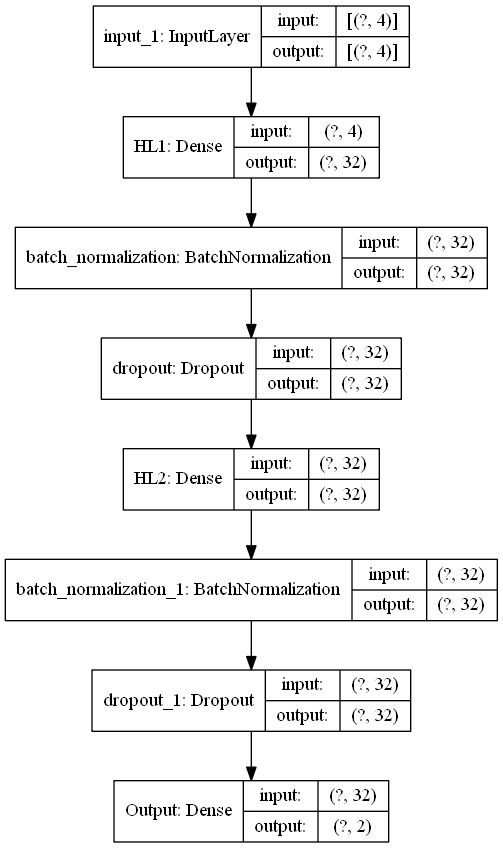

# Customer_Segmentation_Analysis
**Description** : Trained with over 32,000 dataset of customer in a marketing campaign

**Algorithm Model** : Deep Learning method->> BatchNormalization,Dropout,DenseLayer,NeruralNetwork

**Preprocessing step** : Train_test_split, LABEL_ENCODER, ONE HOT ENCODER

**Objectives** :  
1) To produce outcome with accuracy 70%% range of prediction by model trained
                  
2) To predict customer to subscribe product

                 
**Flowchart Model** :

 

### Exploratory Data Analysis (EDA)
1) Data Loading
2) Data Inspection
3) Data Cleaning
4) Features Selection
5) Pre-Processing
6) Model Development -->> DeepLearning
7) Model Evaluation

**Model evaluation** :

`Classification_report`
`accuracy_score`
`Confusion_Matrix`
`Model_train_test_split`
`pickle`
`EDA`

**Data Features** :

1) id	
2) customer_age	
3) job_type	
4) marital	
5) education
6) default	
7) balance	
8) housing_loan
9) personal_loan	
10) communication_type
11) day_of_month
12) month	
13) last_contact_duration
14) num_contacts_in_campaign
15) days_since_prev_campaign_contact
16) num_contacts_prev_campaign
17) prev_campaign_outcome
18) term_deposit_subscribed

**Discussion** :

 🟠The dataset 32000 customer dataset and 17 features with drop ID column which ID is unnecessary for data training
 
 🟠Category and continous features are captured and plotted graph to see correlation
 
 🟠Therefore, from the info of datasets and graph, it shows that there are lot of NaNs value/missing value
 
 🟠In data cleaning, and to compute the NaNs value, the unnessary column,column that has alot of NaN value has to be drop else less accuracy
 
 🟠The model is successfully develop by using batchnormalization,denselayer NN,dropout
 
 🟠from the graph evaluation,loss and acc illustrate a bit underfitting graph but still acceptable for training since it has 90% accuracy score
 
 🟠confusion_matrix,classification_report and f1-score is computed at the end of coding script and shows 90% acc
 
 🟠The model is ready for deployment testing
 
 **Credits** :

[Datasets](https://www.kaggle.com/code/klmsathishkumar/segmentation-of-customers)

The dataset can be upload through the link above and also from my dataset folder

**Enjoy Coding!** 🚀

 
